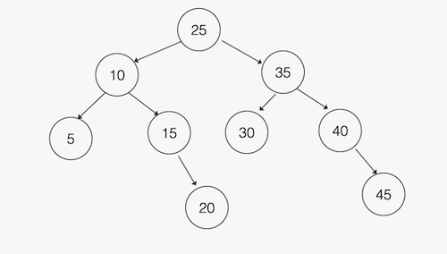

# Sorted Array to Binary Search Tree
An exercise working with Binary Search Trees

## Exercise
Given a sorted array of integers, `arr`, write a function to create a balanced Binary Search Tree from the contents of the array. Return the root of the  Binary Search Tree.

Example:

`arr = [5, 10, 15, 20, 25, 30, 35, 40, 45]`

Should result in a tree with the following root/height:




## Hint

Please note that one does not need to implement a self-balancing Binary Search Tree in order to solve this exercise. 

It is recommended to break the problem down recursively by first setting the root of the Binary Search Tree to the middle element of the array.

## Getting Started

As usual with a python project, create a virtual environment:

```
python3 -m venv venv
```

Then activate the virtual environment

```
source venv/bin/activate
```

Then install the required packages.

```
pip install -r requirements.txt
```